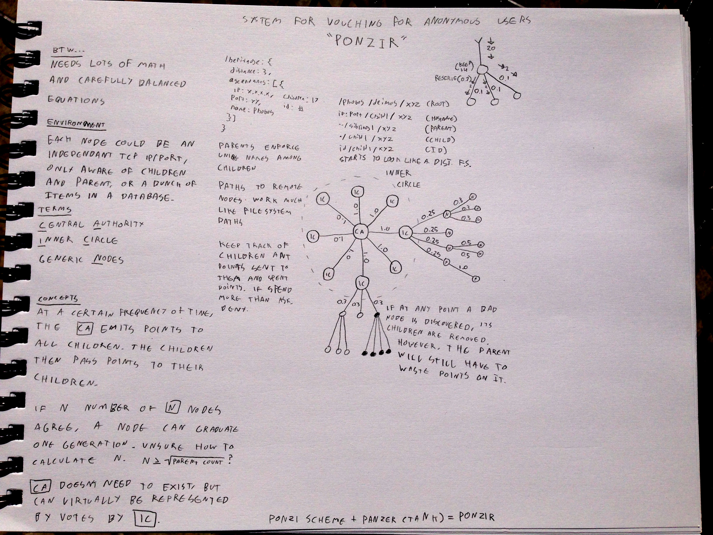

# Ponzir Explained

## What is Ponzir?

Ponzir is a system for vouching for anonymous nodes/users.

Ponzir can modeled as a single application/database, or as a distributed set of nodes communicating over TCP (HTTP?).

Ponzir is uses a hierarchy to represent relationships between nodes. Ever node is aware of its parent, and children.

## Why use Ponzir?

Perhaps you have an invite-only website, and you want to know who is reputable or not.

Perhaps, if you discover a bad node in said member hierarchy, you want to remove then and all their children.

Perhaps you'd like to distribute work amongst a bunch of anonymous nodes, and need to know which ones are more trustworthy.

## Math

This thing will need lots of nicely weighted equations to work smoothly.

## Node Types

* **Central Authority [CA]**: This is the highest level of the Ponzir hierarchy. It might not need to actually exist though.
* **Inner Circle [IC]**: This is the direct children of the [CA] node. They can democratically make decisions for the whole network.
* **Generic Node [GN]**: This represents every other node. Nodes entering the network for the first time are [GN]'s.
* **Node [N]**: This represents a single node of any level.

## Point Distribution

At a regular interval, the [CA] distributes points to child nodes in the [IC]. The [IC] then decide how many to keep for themselves and how many to distribute to their [N] children. Those [N] children do the same in return.

At any point in time, a [N] in the network can exchange accumulated points for some sort of service from the rest of the network, by alerting ascendents all the way up to the [CA].

Sometimes, a [N] can request to graduate up a generation. For this graduation to happen, it requires X number of its direct parents siblings to agree. X is >= SQRT(parent_count). Perhaps there is a bribery of points involved. Can be decided Ad-Hoc.

A parent needs to keep track of the number of points it has been allotted, and the number of points given to which children, and the number of points spent by each child. If a child ever attempts to spend more than they have, the action should be cancelled. Children can optionally be penalized points or point earning rates.

## Types of Work

A Ponzir network is relaxed enough that it should work for many types of work being done. For example, it could represent video rendering. It could represent calculating Pi or other big numbers. It could represent online purchases.

Parents can somehow specify that a child has done incorrect work. Perhaps it gave a bad result, or took too long, or initiated a chargeback.

## Punishments

If a node is ever determined to be bad, the parent should remove it from the network. Once a node is removed, none of its children are in the network. All children lose points.

If a [N] is determined to be bad, and all siblings of the [N] vote in favor, the bad [N] can be removed from the system.

If a [N] is determined to be bad, the parent can remove it from the system.

If a [N] is determined to be bad, and >=SQRT(parent_nodes) vote in favor, the [N] should be removed from the system. If this doesn't happen, more [N] siblings can vote, and have parent([N]) removed.

## Overspending

In theory, a parent can spend points that it has told belong to its children. This is much like a bank. While this should be discouraged, it is completely fine, as a [N] should only join other [N]'s that it trusts in some regard.

## [N] Attributes

A node needs to have the following attributes:

    {
      "address": "10.1.1.10:5000", // A way to identify the host. Can use a hostname, and can assume a default port. URLs?
      "name": "dragon", // A unique-amongst-siblings way to identify the host. Can be changed. Graduations may require name changes.
      "children_count": 17, // Should keep track of the number of children it has
      "uuid": "d6d1893a-39b6-11e3-8d6d-cd95c531c7ca", // A globally unique identifier
      "parent": "10.1.1.9:5000", // A pointer back to the parent
    }

## [N] Methods

A node should have the following methods (JSON-RPC? REST?):

    /heritage: Get information about heritage
    /uuid: Get the UUID of this [N]
    /join: Attempt to join this [N]
    /graduate: Attempt to graduate to being a sibling of this [N]
    /rename: Tell this parent [N] that you are renaming yourself
    /children: Ask for information about this [N]'s children (can say no)

## [N] Status

A node can be online or offline or banned. A parent can decide when to remove an offline node, e.g. after a certain period of time.
